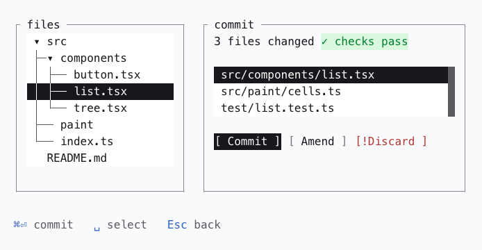

# rockaway

**A TUI design system for the web.** Everything sits on a character grid: one
cell wide, one row tall, no halves.

<picture>
  <source media="(prefers-color-scheme: dark)" srcset="docs/assets/screen-dark.png">
  
</picture>

<sub>A real screen, captured from the workbench: Frame, Tree, List, Badge, Button
and KeyHint at the default density.</sub>

**[The site](https://oddurs.github.io/rockaway/)** · [The concept](docs/concept.md) ·
[What is public](docs/public-api.md) · [Roadmap](ROADMAP.md)

Terminals have been doing a lot with a little for fifty years. The constraint
is the point — a grid you cannot fall off, screens you can diff as text, and a
palette your reader already has. rockaway takes that model seriously on the
web, where the reader might be on a phone, at 400% zoom, or using a screen
reader.

[**The concept**](docs/concept.md) explains how a TUI becomes a web page: frames
as data, two layers, four painters over one geometry, and the rules that follow.

> [!NOTE]
> **Pre-release.** Nothing is on npm yet; the first release will be 0.1.0. The
> engine, the four painters, the tokens with ten themes, the CSS and eleven
> components are built and tested: Frame, Divider, Button, Link, KeyHint,
> Badge, Callout, List, Tree, and the field and fieldset that forms are built
> from. Below 1.0 a minor version can break, and says so in its changelog.
> The [roadmap](ROADMAP.md) is the truth.

## Getting started

Once 0.1.0 is published:

```sh
npm install @rockaway/react @rockaway/css @rockaway/tokens
```

React 19 is a peer dependency. Import the CSS once, the contract first and the
tokens after it:

```css
@import '@rockaway/css';
@import '@rockaway/tokens/tokens.css';
```

Then compose:

```tsx
import { Button, Frame, List, ListItem } from '@rockaway/react';

export function Commit() {
  return (
    <Frame title="commit" cols={40} rows={8}>
      <List aria-label="Changed files" rows={3} selectionMode="single">
        <ListItem id="list">src/components/list.tsx</ListItem>
        <ListItem id="cells">src/paint/cells.ts</ListItem>
        <ListItem id="test">test/list.test.ts</ListItem>
      </List>
      <Button variant="fill" onPress={() => console.log('commit')}>
        Commit
      </Button>
    </Frame>
  );
}
```

The frame measures its cell from the font, so any monospace font works.
Switch the context on any element: `data-theme="dark"` for the mode,
`data-density="touch"` for the line box, and `data-rk-theme="dracula"` for a
theme, with that theme's stylesheet imported after the tokens. The
getting-started guide on the site goes further.

## What it is

- **An integer geometry engine.** Boxes, junctions, text measurement and layout, all in whole cells, with no DOM in it. It runs in a browser, in Node, and in a test.
- **Four painters over one geometry.** Lines stroked like type, lines as CSS hairlines, ANSI escapes, or plain text. The same screen, four outputs, one source of truth.
- **The font supplies letters; the cell supplies geometry.** Box drawing and block elements are drawn by the cell, the way kitty and Ghostty draw them, so a box closes at every density, in every font, at any zoom — and the characters stay in the page, so a screen still copies as `┌──┐`.
- **Tokens as data.** DTCG sources, an ANSI-16 palette generated in OKLCH, and a contrast gate that every pair has to pass, in both modes.
- **Components on React Aria.** Keyboard-first, because that is what a TUI is, and what React Aria is best at.

## Strictness is a dial

A grid nobody can break is a grid people quietly abandon. Pick the level your
app wants:

| Level | Layout | Frames | Spacing |
| --- | --- | --- | --- |
| `strict` | whole cells | glyphs only | whole cells |
| `standard` | whole cells | glyphs or CSS rules | whole cells, half a cell inside controls |
| `loose` | whole cells for panes | any painter, radius allowed | free inside a pane |

And when you break the grid, say so:

```html
<div data-rk-offgrid="the logo is 37px and the brand team won">…</div>
```

The conformance test fails on anything off the grid that does not carry a
reason, and prints the ones that do. Exceptions become countable instead of
accumulating quietly.

## What you get, and what you give up

**Given up:** corner radii, drop shadows, arbitrary sizes, a type scale,
photographs, emoji (their width is a lottery), and easing curves.

**Gained:** chrome that is text, emphasis as attributes (bold, dim, reverse,
underline), sixteen colours everybody already themes, frames on a tick, and
two tests that a pixel system cannot run:

- **Grid conformance** — every box measures a whole number of cells, in every theme and density.
- **Text snapshots** — a component's test looks like the component.

And a third that reads real pixels: **continuity**, which proves every line
reaches the edges of its cell and meets its neighbour there.

```diff
- │ [ Publish ]  [ Cancel ]             │
+ │ [ Publish ]  [ Preview ]  [ Cancel ]│
```

## On a phone

The cell comes from the font, in `rem`, so browser zoom and the reader's font
size work untouched. Touch does not get a second layout: it gets a bigger
cell — `touch` density puts a one-row control at 44px without moving a single
coordinate. The default density, `normal`, makes a row 24px, the target size
WCAG 2.2 AA asks for; `airy` gives room to read, and `dense` is the opt-in for
a terminal's tightness, at the cost of that target size. Layout responds to how many cells it has, at 40, 60, 80 and
120 columns, the widths terminals have always used.

## Packages

| Package | What it is |
| --- | --- |
| `@rockaway/grid` | The engine: cells, boxes, junctions, text measurement, layout, painters |
| `@rockaway/tokens` | DTCG sources, the ANSI palette, cell metrics, glyph sets, the resolver |
| `@rockaway/css` | The CSS contract: cascade layers, reset, base, forced colors |
| `@rockaway/react` | Components, on React Aria |
| `@rockaway/mcp` | An MCP server: the components, tokens and docs, for coding agents |

The engine has no dependencies and no DOM. The tokens and the CSS are
framework-free. Only the components are React.

## Development

Node 24, pnpm 12.

```sh
pnpm install
pnpm storybook     # the workbench
pnpm check         # lint, typecheck, build, tests, roadmap
```

The roadmap and every decision live in the repository as Markdown, managed
with [cairn](https://github.com/oddurs/cairn): `cairn next` shows what is ready.
Architecture decisions are items too, with their context and consequences —
start with [why it is a TUI system](cairn/items), items 0070 to 0077.

See [CONTRIBUTING.md](CONTRIBUTING.md) to get started, and the
[code of conduct](CODE_OF_CONDUCT.md). Report a vulnerability privately, as
[SECURITY.md](SECURITY.md) says.

## License

[MIT](LICENSE). The imported terminal themes keep their own licences, which sit
beside them in [`packages/tokens/themes/terminal`](packages/tokens/themes/terminal).
